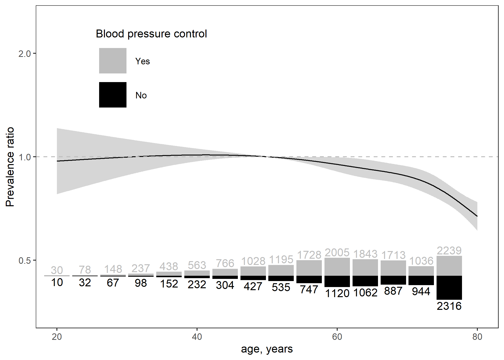

<!-- README.md is generated from README.Rmd. Please edit that file -->

# spline-pr

<!-- id: a0217837100 -->
<!-- amanda: a0217837101 -->
<!-- group: 3372 -->

The goal of spline-pr is to fit poisson regression models with
generalized estimating equations (i.e., robust variance estimators for
prevalence ratios) that include spline terms. The code in this repo also
generates plots that show the estimated spline curve over a domain
specified by the user.

# Example

This example uses NHANES data to create a spline figure showing the
prevalence ratio for blood pressure control as a function of age. Since
we are dealing with blood pressure control, we filter the data to
include only participants with self-reported antihypertensive medication
use. Also, since this is not a ‘survey’ tutorial, we do not engage with
the NHANES survey weights.

``` r
library(table.glue)
library(tidyverse)
library(splines)
library(geepack)
library(mice)
#> Warning: package 'mice' was built under R version 4.1.1

source("R/functions.R")

data_nhanes <- table.glue::nhanes %>% 
 as_tibble() %>% 
 select(age, bp_sys_mmhg, bp_dia_mmhg, meds_bp) %>% 
 filter(meds_bp == 'yes', age >= 20)

data_nhanes
#> # A tibble: 4,796 x 4
#>      age bp_sys_mmhg bp_dia_mmhg meds_bp
#>    <dbl>       <dbl>       <dbl> <chr>  
#>  1    72        142         82   yes    
#>  2    73        137.        86.7 yes    
#>  3    56        157.        82   yes    
#>  4    76        127.        66.7 yes    
#>  5    60        127.        74   yes    
#>  6    65        141.        57.3 yes    
#>  7    72        160         71.3 yes    
#>  8    80        109.        53.3 yes    
#>  9    43        140         82.7 yes    
#> 10    65         NA         NA   yes    
#> # ... with 4,786 more rows
```

## Imputation of blood pressure values

As with almost all data, we have missing values. Thus, we will use
multiple imputation and pool our spline estimates from each imputed
dataset.

``` r
n_imputes <- 5

data_nhanes_impute <- data_nhanes %>% 
 # remove constant column (all meds_bp == 'yes')
 select(-meds_bp) %>% 
 # run the imputation models
 mice(method = 'pmm', m = n_imputes, printFlag = FALSE) %>% 
 # get the imputed data, action = 'all' means return every imputed data set
 complete(action = 'all') %>% 
 # convert each imputed dataset to a tibble for better printing
 map(as_tibble)

# print the first imputed dataset 
data_nhanes_impute[[1]]
#> # A tibble: 4,796 x 3
#>      age bp_sys_mmhg bp_dia_mmhg
#>    <dbl>       <dbl>       <dbl>
#>  1    72        142         82  
#>  2    73        137.        86.7
#>  3    56        157.        82  
#>  4    76        127.        66.7
#>  5    60        127.        74  
#>  6    65        141.        57.3
#>  7    72        160         71.3
#>  8    80        109.        53.3
#>  9    43        140         82.7
#> 10    65        139.        59.3
#> # ... with 4,786 more rows
```

## Post-processing of imputed values

Let’s not forget that our outcome is dependent on the two blood pressure
variables; i.e., blood pressure control is 1 if systolic blood pressure
is &lt; 140 mm Hg and diastolic blood pressure is &lt; 90 mm Hg. .

``` r
data_nhanes_impute <- data_nhanes_impute %>% 
 map(
  ~ .x %>% 
   mutate(
    bp_control = if_else(
     condition = bp_sys_mmhg < 140 & bp_dia_mmhg < 90,
     true = 1,
     false = 0
    )
   )
 )

data_nhanes_impute[[1]]
#> # A tibble: 4,796 x 4
#>      age bp_sys_mmhg bp_dia_mmhg bp_control
#>    <dbl>       <dbl>       <dbl>      <dbl>
#>  1    72        142         82            0
#>  2    73        137.        86.7          1
#>  3    56        157.        82            0
#>  4    76        127.        66.7          1
#>  5    60        127.        74            1
#>  6    65        141.        57.3          0
#>  7    72        160         71.3          0
#>  8    80        109.        53.3          1
#>  9    43        140         82.7          0
#> 10    65        139.        59.3          1
#> # ... with 4,786 more rows
```

## Model fitting

Next we fit a `geeglm` model to each imputed dataset. Note that

``` r
fits <- map(
  .x = data_nhanes_impute,
  .f = ~ geeglm(bp_control ~ ns(age, df = 4), 
                data = .x, 
                id = seq(nrow(.x)))
)

summary(fits[[1]])
#> 
#> Call:
#> geeglm(formula = bp_control ~ ns(age, df = 4), data = .x, id = seq(nrow(.x)))
#> 
#>  Coefficients:
#>                  Estimate  Std.err    Wald Pr(>|W|)    
#> (Intercept)       0.69718  0.06510 114.690   <2e-16 ***
#> ns(age, df = 4)1 -0.04489  0.05971   0.565   0.4522    
#> ns(age, df = 4)2 -0.09171  0.05572   2.709   0.0998 .  
#> ns(age, df = 4)3 -0.14803  0.14701   1.014   0.3140    
#> ns(age, df = 4)4 -0.25158  0.02652  90.018   <2e-16 ***
#> ---
#> Signif. codes:  0 '***' 0.001 '**' 0.01 '*' 0.05 '.' 0.1 ' ' 1
#> 
#> Correlation structure = independence 
#> Estimated Scale Parameters:
#> 
#>             Estimate  Std.err
#> (Intercept)   0.2268 0.002057
#> Number of clusters:   4796  Maximum cluster size: 1
```

## Spline pooling

``` r
# determine a spline basis function
# the terms used here must match those in geeglm()
bases <- map(
  .x = data_nhanes_impute,
  .f = ~ ns(.x$age, df = 4)
)

# using the fit and basis function,
# get a predicted spline estimate + SE
spline_preds <- map2(
  .x = fits, 
  .y = bases, 
  .f = get_spline_preds,
  pattern = '^ns\\(',
  x_min = 20, 
  x_max = 80,
  x_ref = 50
)

# pool results using Rubin's rules

# V_w = mean of the variance estimates
variance_within <- map_dfc(spline_preds, "se") %>% 
  apply(MARGIN = 1, function(x) mean(x^2))

# V_b = variance of the predictions
variance_between <- map_dfc(spline_preds, "pred") %>% 
  apply(MARGIN = 1, var)

# V_total = V_w + V_b * (n_imputes+1) / n_imputes
variance_total <- 
  variance_within + variance_between + variance_between/n_imputes

se_pooled <- sqrt(variance_total)

spline_pool <- tibble(
  x = spline_preds[[1]]$x,
  pred = apply(map_dfc(spline_preds, "pred"), 1, mean),
  se = se_pooled,
  ci_lwr = pred + qnorm(0.025) * se,
  ci_upr = pred + qnorm(0.975) * se
)

spline_pool
#> # A tibble: 1,000 x 5
#>        x     pred     se ci_lwr ci_upr
#>    <dbl>    <dbl>  <dbl>  <dbl>  <dbl>
#>  1  20   -0.00480 0.0773 -0.156  0.147
#>  2  20.1 -0.00472 0.0770 -0.156  0.146
#>  3  20.1 -0.00464 0.0768 -0.155  0.146
#>  4  20.2 -0.00456 0.0766 -0.155  0.146
#>  5  20.2 -0.00448 0.0764 -0.154  0.145
#>  6  20.3 -0.00440 0.0762 -0.154  0.145
#>  7  20.4 -0.00431 0.0760 -0.153  0.145
#>  8  20.4 -0.00423 0.0757 -0.153  0.144
#>  9  20.5 -0.00415 0.0755 -0.152  0.144
#> 10  20.5 -0.00407 0.0753 -0.152  0.144
#> # ... with 990 more rows
```

## Spline visualization

``` r
data_imputed_stack <- bind_rows(data_nhanes_impute)

data_segment <- bin_segments(x = data_imputed_stack$age,
                             y = data_imputed_stack$bp_control,
                             x_min = 20,
                             x_max = 80,
                             by_y = TRUE,
                             bin_length = 1,
                             bin_count = 60,
                             bin_yintercept = 2/3) %>%
  mutate(event_status = factor(event_status,
                               levels = c(1, 0),
                               labels = c("Yes", "No")))


fig <- ggplot(spline_pool) + 
 aes(x = x, 
     y = exp(pred), 
     ymin = exp(ci_lwr), 
     ymax = exp(ci_upr)) + 
 labs(x = 'age, years',
      y = 'Prevalence ratio',
      color = 'Blood pressure control') + 
 geom_line() + 
 geom_ribbon(alpha = 0.2) + 
 scale_y_log10() + 
 geom_segment(data = data_segment, 
              inherit.aes = FALSE,
              size = 2,
              mapping = aes(x = x, 
                            y = y,
                            color = event_status,
                            xend = xend, 
                            yend = yend)) + 
 theme_bw() + 
 geom_hline(yintercept = 1, linetype = 2, color = 'grey') + 
 theme(panel.grid = element_blank(),
       legend.position = c(.2, 0.42)) + 
 scale_color_manual(values = c("grey", "black"))

fig
```

<!-- -->
